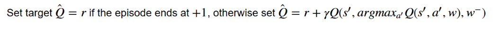
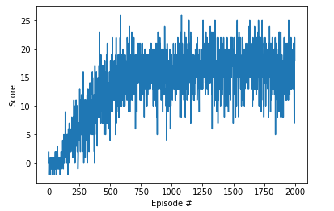

# Project 1: Navigation

Author: [Shashanak BR](https://github.com/shashanka300)

The goal of the project  is to demonstrates the ability of value-based methods, ex Deep Q-learning, to learn a suitable policy in a model-free Reinforcement Learning setting using a Unity environment, which consists of a continuous state space of 37 dimensions corresponding to 35 dimensions of ray-based perception of objects.  The 35 dimensions of ray perception are broken down as: 7 rays projecting from the agent at the following angles (and returned back in the same order): [20, 90, 160, 45, 135, 70, 110] where 90 is directly in front of the agent. Each ray is 5 dimensional and it projected onto the scene. If it encounters one of four detectable objects (i.e. yellow banana, wall, blue banana, agent), the value at that position in the array is set to 1. with a goal to navigate around and collect yellow bananas while avoiding blue bananas. There are 4 actions to choose from:

- **FORWARD=0**
- **BACKWARD=1**
- **LEFT=2**
- **RIGHT=3**

The task is episodic, and in order to solve the environment, the agent must get an average score of +13 over 100 consecutive episodes.

## Implementation
The standard Q-learning update for the parameters after taking action At in state St and observing the
immediate reward Rt+1 and resulting state St+1

- **DQN** 
A deep Q network (DQN) is a multi-layered neural network
that for a given state s outputs a vector of action values
Q(s, θ), where θ are the parameters of the network. For
an n-dimensional state space and an action space containing m actions, the neural network is a function from R
n to
R
m. The two important ingredients of the DQN algorithm are the use of a target network, and the use of experience replay. 
The max operator in standard Q-learning and DQN, uses the same values both to select and to evaluate an action. This makes it more likely to select overestimated values, resulting in overoptimistic value estimates.

- **DDQN**
 Double Q-learning algorithm, two value
functions are learned by assigning each experience randomly to update one of the two value functions, such that
there are two sets of weights, θ and θ'
. For each update, one
set of weights is used to determine the greedy policy and the
other to determine its value.The idea of Double Q-learning is to reduce overestimations by decomposing the max operation in the target into action selection and action evaluation. Although not fully decoupled, the target network in the DQN architecture provides
a natural candidate for the second value function, without
having to introduce additional networks.
Therefore, Double DQN helps us reduce the overestimation of q values and, as a consequence, helps us train faster and have more stable learning.

### Model architectures
The function approximator used is a 2 layer fully connected neural network with the input layer dimension being 37, the first hidden layer being 64 dimensional, the second layer also being 64
dimensional the out put from these is used to cal culate the value functio and the advantage function , and the final output  being 4 dimensional — for each of the 4 different actions. The model is trained using Adam optimizer to update the weights.

  ### Hyperparameters

  There were many hyperparameters involved in the experiment. The value of each of them is given below:

  | Hyperparameter                      | Value |
  | ----------------------------------- | ----- |
  | Buffer size                         | le6 |
  | Batch size                           |64 |
  |Gamma 								|.99|
  | Number of episodes                  | 2000   |
  | Max number of timesteps per episode | 1000  |
  | Epsilon start                       | 1.0   |
  | Epsilon minimum                     | 0.01   |
  | Epsilon decay                       | 0.995 |

I trained the agent using the double DQN algorithm. After training for 2000 episodes, the 100 episode reward increased to around 17 as shown below.

| DDQN_Result                                                                  |
| ------------------------------| 
 | 

## Ideas for improvement

- Using Prioritized Replay [paper](https://arxiv.org/abs/1511.05952) showed a massive improvement over Double DQNs for Atari games. It is expected  to an improved performance here .
- Other improment is is the rainbow network [paper](https://arxiv.org/pdf/1710.02298.pdf)
- Hyperparameter search for both Double DQNs and Dueling Double DQNs should lead to better performance too.