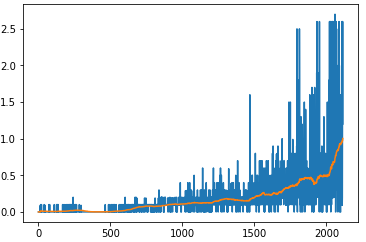

# Project 3: Collaboration and Competition

### Introduction

For this project, you will work with the [Tennis](https://github.com/Unity-Technologies/ml-agents/blob/master/docs/Learning-Environment-Examples.md#tennis) environment.

In this environment, two agents control rackets to bounce a ball over a net. If an agent hits the ball over the net, it receives a reward of +0.1.  If an agent lets a ball hit the ground or hits the ball out of bounds, it receives a reward of -0.01.  Thus, the goal of each agent is to keep the ball in play.

The observation space consists of 8 variables corresponding to the position and velocity of the ball and racket. Each agent receives its own, local observation.  Two continuous actions are available, corresponding to movement toward (or away from) the net, and jumping. 

The task is episodic, and in order to solve the environment, your agents must get an average score of +0.5 (over 100 consecutive episodes, after taking the maximum over both agents). Specifically,

- After each episode, we add up the rewards that each agent received (without discounting), to get a score for each agent. This yields 2 (potentially different) scores. We then take the maximum of these 2 scores.
- This yields a single **score** for each episode.

The environment is considered solved, when the average (over 100 episodes) of those **scores** is at least +0.5.

### Getting Started

1. Download the environment from one of the links below.  You need only select the environment that matches your operating system:
    - Linux: [click here](https://s3-us-west-1.amazonaws.com/udacity-drlnd/P3/Tennis/Tennis_Linux.zip)
    - Mac OSX: [click here](https://s3-us-west-1.amazonaws.com/udacity-drlnd/P3/Tennis/Tennis.app.zip)
    - Windows (32-bit): [click here](https://s3-us-west-1.amazonaws.com/udacity-drlnd/P3/Tennis/Tennis_Windows_x86.zip)
    - Windows (64-bit): [click here](https://s3-us-west-1.amazonaws.com/udacity-drlnd/P3/Tennis/Tennis_Windows_x86_64.zip)
    
    (_For Windows users_) Check out [this link](https://support.microsoft.com/en-us/help/827218/how-to-determine-whether-a-computer-is-running-a-32-bit-version-or-64) if you need help with determining if your computer is running a 32-bit version or 64-bit version of the Windows operating system.

    (_For AWS_) If you'd like to train the agent on AWS (and have not [enabled a virtual screen](https://github.com/Unity-Technologies/ml-agents/blob/master/docs/Training-on-Amazon-Web-Service.md)), then please use [this link](https://s3-us-west-1.amazonaws.com/udacity-drlnd/P3/Tennis/Tennis_Linux_NoVis.zip) to obtain the "headless" version of the environment.  You will **not** be able to watch the agent without enabling a virtual screen, but you will be able to train the agent.  (_To watch the agent, you should follow the instructions to [enable a virtual screen](https://github.com/Unity-Technologies/ml-agents/blob/master/docs/Training-on-Amazon-Web-Service.md), and then download the environment for the **Linux** operating system above._)

 

  

## Implementation

n this environment, two agents control rackets to bounce a ball over a net. If an agent hits the ball over the net, it receives a reward of +0.1. If an agent lets a ball hit the ground or hits the ball out of bounds, it receives a reward of -0.01. Thus, the goal of each agent is to keep the ball in play.

The observation space is 24-dimensional consisting of 8 variables corresponding to the position and velocity of the ball and racket. Each agent receives its own, local observation. Two continuous actions are available, corresponding to movement toward (or away from) the net, and jumping. Each agent receives its own, local observation. Two continuous actions are available, corresponding to movement toward (or away from) the net, and jumping.

The task is episodic, and in order to solve the environment, the agents must get an average score of +0.5 (over 100 consecutive episodes, after taking the maximum over both agents). Specifically, after each episode, all the rewards that each agent receives (without discounting) are added up to get a score for each agent. This yields 2 (potentially different) scores. The maximum of these 2 scores is then taken, and thus yielding a single score for each episode.

The environment is considered solved, when the average (over 100 consecutive episodes) of these scores is at least +0.5.

[Multi Agent Deep Deterministic Policy Gradient (MADDPG)](https://arxiv.org/pdf/1706.02275.pdf) It requires the training of two separate agents, and the agents need to collaborate under certain situations (like don’t let the ball hit the ground) and compete under other situations (like gather as many points as possible). Just doing a simple extension of single agent RL by independently training the two agents does not work very well because the agents are independently updating their policies as learning progresses. And this causes the environment to appear non-stationary from the viewpoint of any one agent. While we can have non-stationary Markov processes, the convergence guarantees offered by many RL algorithms such as Q-learning requires stationary environments. While there are many different RL algorithms for multi-agent settings, for this project I chose to use the Multi Agent Deep Deterministic Policy Gradient (MADDPG) algorithm [1].

The primary motivation behind MADDPG is that if we know the actions taken by all agents, the environment is stationary even as the policies change, since P(s’|s,a1,a2,π1,π2) = P(s’|s,a1,a2) = P(s’|s,a1,a2,π’1,π’2) for any πi ≠ π’i. This is not the case if we do not explicitly condition on the actions of other agents, as done by most traditional RL algorithms

All of the above mentioned techniques were incorporated. The entire implementation was done in PyTorch. 

Also, in my experience, I have found Batch normalization to have always improved training and hence, I added one Batch normalization layer in both actor and critic. Upon trying out both ReLU and Leaky ReLU, I found the latter to work better and hence, 

### Model architectures of the actor and critic networks
- **Actor**: Network that maps states -> actions.
     I used a two-layer neural network with 24 units in the input layer, 256 in the first hidden layer, 128 units in the second hidden layer, and 2 units in the output layer.
    
- **Citic**: Network that maps (state, action) pairs -> Q-values.I used a two-layer neural network with 48 units in the input layer, 256 units in the first hidden layer, 128 units in the second hidden layer, and 1 unit in the output layer.

The network was trained using Adam optimizer with elu non-linearity for faster training. I performed a few things to help speed up the learning process.
- For the first 300 episodes, no learning occurred. The agents were just doing random exploration. 
- Thereafter, for each step in the environment, each agent performed three learning iterations.
- The additive noise introduced by a normal distribution for better exploration was gradually decayed down to 10% of the noise amount used at the beginning of training. Additionally, using a normal distribution for exploration was found to be much more effective than using the Ornstein–Uhlenbeck noise process.

### Hyperparameters

There were many hyperparameters involved in the experiment. The value of each of them is given below:

| Hyperparameter                      | Value |
| ----------------------------------- | ----- |
| Replay buffer size                  | 1e5   |
| Batch size                          | 256  |
| $\gamma$ (discount factor)          | 0.99  |
| $\tau$                              | 1e-3  |
| Actor Learning rate                 | 1e-4  |
| Critic Learning rate                | 3e-4  |
| WEIGHT_DECAY_actor                   | 0    |
|WEIGHT_DECAY_critic                   | 0    |
| Number of episodes                  | 2500   |
| Max number of timesteps per episode | 1000  |
| Leak for LeakyReLU                  | 0.01  |

  #Results

  

   

  The trained agent can be seen in action below:

![Trained Agent][image1]

## Ideas for Future Improvement:
1. Use parameter space noise rather than noise on action. https://github.com/jvmancuso/ParamNoise
2. We can use prioritised experience buffer. https://github.com/Damcy/prioritized-experience-replay
3. Different replay buffer for actor/critic
4. Try adding dropouts in critic network
5. Turn off OU noise and use random noise
6. You should also try implementing some other algorithms like A3C and PPO. Following are some useful posts.
    [Asynchronous Actor-Critic Agents (A3C)](https://medium.com/emergent-future/simple-reinforcement-learning-with-tensorflow-part-8-asynchronous-actor-critic-agents-a3c-c88f72a5e9f2)
    
    [Trust Region Policy Optimization (TRPO) and Proximal Policy Optimization (PPO)](https://medium.com/@sanketgujar95/trust-region-policy-optimization-trpo-and-proximal-policy-optimization-ppo-e6e7075f39ed)

[image1]: https://user-images.githubusercontent.com/10624937/42135623-e770e354-7d12-11e8-998d-29fc74429ca2.gif "Trained Agent"
[image2]: https://user-images.githubusercontent.com/10624937/42135622-e55fb586-7d12-11e8-8a54-3c31da15a90a.gif "Soccer"
